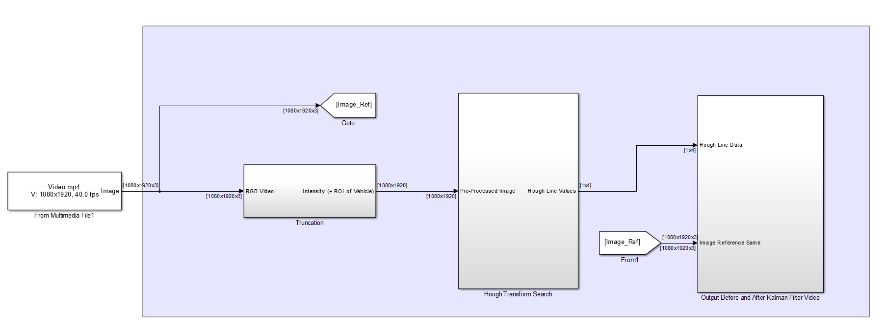
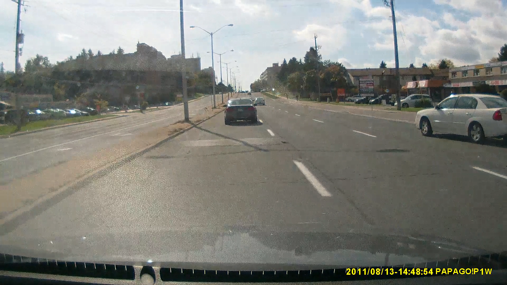
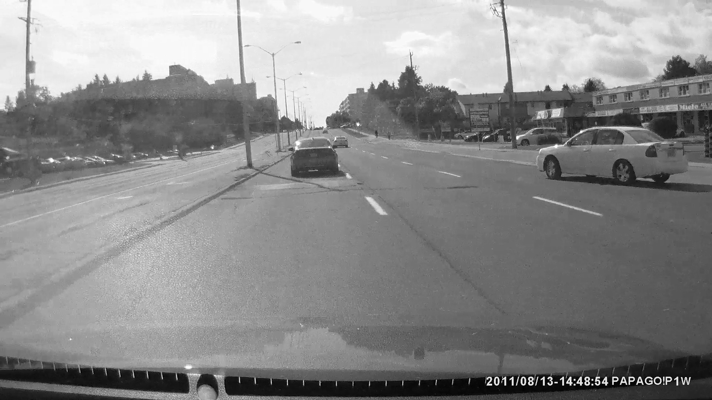
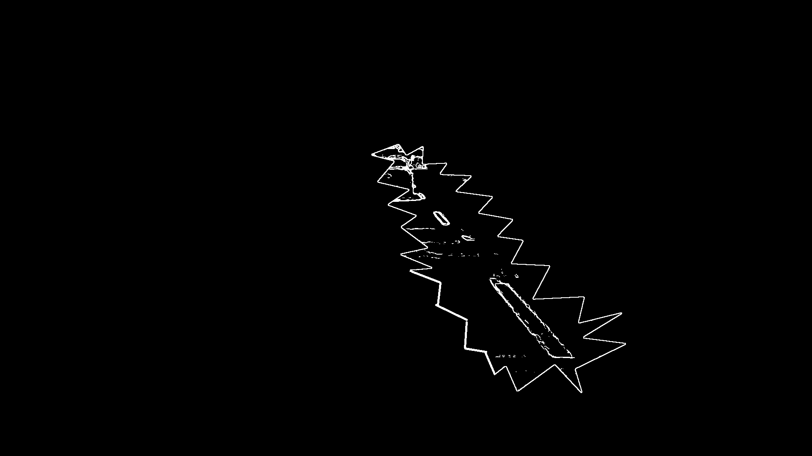
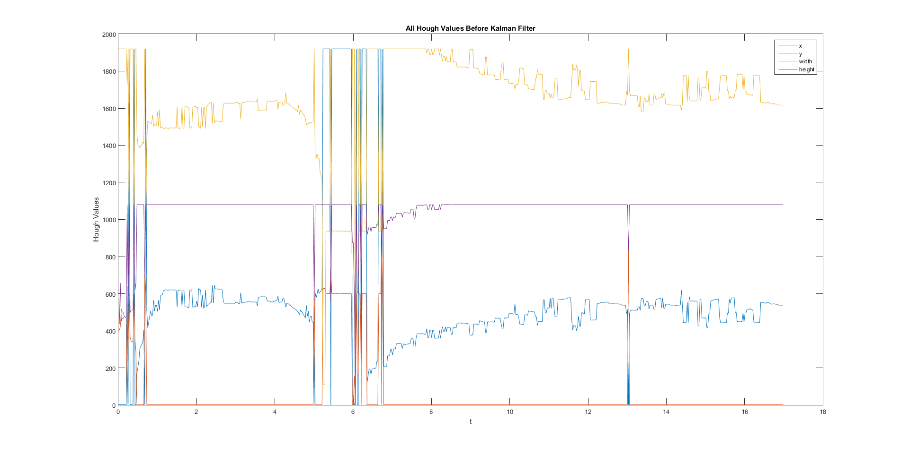
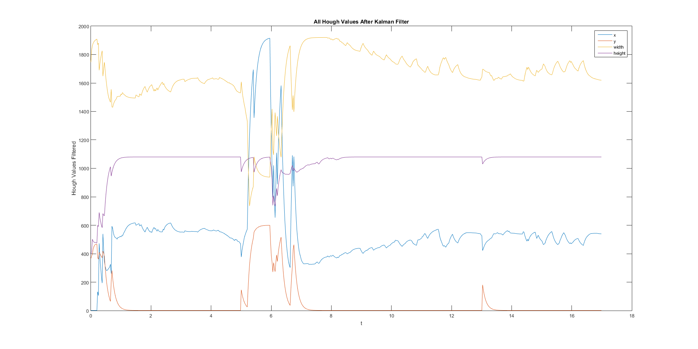

# Lane Tracking

# Introduction

This code was a result from one of my courses project requirements. I wanted to implement a real case use from my Algorithms for Parameter & State Estimation course. In this project, I implemented a variety of computer vision and estimation algorithms to detect lanes on the road. The video footage used as the primary test case came from my Subaru's dashcam. As a result, I was using a genuine video file and was able to  

# Algorithms

From a very high level perspective, the computer vision algorithms used were gray scaling Sobel edge detection, and line Hough transformations. A Kalman filter was also used to smooth out and help follow along a road for a given time. 

### Kalman Filtering

Kalman filtering provided an interesting dynamic to the computer vision algorithm and brought in a layer of memory in order to detect lanes. In essence, the Kalman filter attempts to estimate a trend within a dynamic system. More specifically, the filter has a current measurement and future measurement prediction system. The Kalman filter works by constantly trying to guess the next measurement in the system and compares itself with the real measurement of the system. This constant comparison changes the Kalman filters tracking algorithm to trust more of it's previous measurement values or more of the new incoming values in a markov process tree branch.

The filter has very desirable characteristics as it is very light on memory so it does not require a lot of memory overhead in order to calculate new measurements in time. This would bring forth a multitude of trade-offs between offline and onine estimation, but that would be for another topic entirely.  

# Discussion

#High Level Simulink Diagram

#Image Workflow

Below are the various images captured intermittently when my computer vision and estimation algorithms were applied

# Kalman Filter Data

