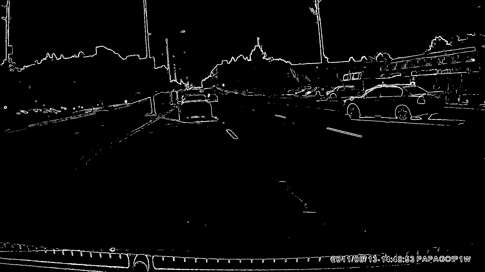

# Lane Tracking

# Introduction

This code was a result from one of my courses project requirements. I wanted to implement a real case use from my Algorithms for Parameter & State Estimation course. In this project, I implemented a variety of computer vision and estimation algorithms to detect lanes on the road. The video footage used as the primary test case came from my Subaru's dashcam. As a result, I was using a genuine video file and was able to  

# Algorithms

From a very high level perspective, the computer vision algorithms used were gray scaling Sobel edge detection, and line Hough transformations.

# Discussion

#High Level Simulink Diagram

#Image Workflow

Below are the various images captured intermittently when my computer vision and estimation algorithms were applied

# Kalman Filter Data

